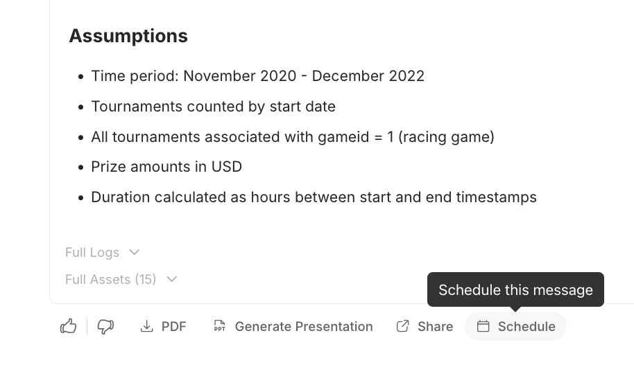
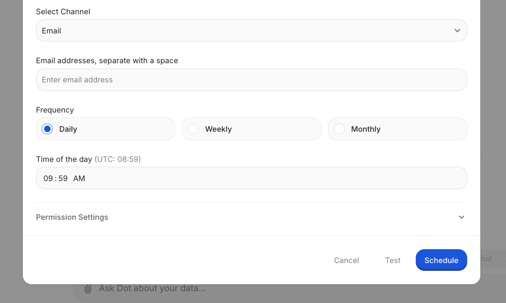

# Scheduling

Schedule Deep Analysis reports to be delivered automatically via Email, Slack, or Teams.

Unlike dashboard snapshots that show numbers, scheduled reports explain what changed and why—with trends, anomalies, and recommendations included.

### Use Cases

**Meeting prep**: Schedule 30 minutes before recurring meetings. Your team gets context without manually checking dashboards.

**Weekly reviews**: "What changed this week?" delivered Monday morning to Slack—ready for discussion.

**Replace dashboard check-ins**: Instead of pulling data, insights come to you.

### Creating a Schedule

1. Run a Deep Analysis query
2. Click the **Schedule** button on the response

<figure><figcaption>
Click Schedule to set up recurring delivery
</figcaption></figure>

3. Choose delivery channel (Email/Slack/Teams)
4. Add recipients
5. Set frequency: Daily, Weekly (pick day), or Monthly (pick date)
6. Click **Schedule**

<figure><figcaption>
Configure channel, recipients, and frequency
</figcaption></figure>

Click **Test** to send a preview before committing.

### Managing Schedules

Open the schedule modal on any scheduled message to:
- Edit frequency or recipients
- View run history (past deliveries and costs)
- Delete the schedule

### Work Gate — Skip Runs When There's Nothing New

Avoid wasting credits on scheduled runs when conditions aren't met. A work gate checks your database before the agent runs — if the check fails, the run is skipped entirely and no credits are consumed.

**Use cases:**

- Skip a daily sales report if no new orders arrived
- Don't run a pipeline health check until the ETL job has finished
- Only analyze data after a specific table was updated

Dot writes and maintains the gate script for you based on a condition you describe. You can test the gate against live data before activating it. Skipped runs show as `work_gate_blocked` in run history.


If the gate encounters an error, the agent runs anyway (fail-open) — so you never silently miss a report.


---

### Result Gate — Only Deliver When It Matters

Reduce notification noise by setting a plain-English condition that controls whether the report is actually sent to recipients.

The agent still runs the full analysis, but only delivers the report if your condition is met. No extra cost — the condition is evaluated as part of the normal analysis.

**Examples:**

- _"Only send if monthly revenue decreased by more than 5%"_
- _"Send only when there are more than 3 anomalies detected"_
- _"Deliver if customer churn rate exceeds the previous month"_

Suppressed reports show as `result_gate_suppressed` in run history, so you can always review what was analyzed but not delivered.

---

### Combining Both Gates

You can use work gate and result gate together on the same schedule:

1. **Work gate** checks if there's reason to run at all (saves credits)
2. **Result gate** checks if the findings are worth delivering (reduces noise)

Example: A daily pipeline report with a work gate that skips if the ETL hasn't finished, and a result gate that only sends when the error count is above threshold.

---

### Full Analysis Delivery

By default, scheduled reports deliver an executive summary PDF. Admins can enable **full analysis delivery** to send the complete report — text, charts, tables, and files — directly in the email or message.

**To enable:** Go to **Settings → Modules** and toggle **Send full analysis in scheduled reports**.

This applies to all schedules in your organization. You can toggle it anytime without recreating schedules.

| Channel | Default | Full Analysis |
|---------|---------|---------------|
| **Email** | Summary PDF | Full report with charts and data |
| **Slack** | Summary message | Complete analysis with visualizations |
| **Teams** | Summary card | Full card with charts and PDF download |

---

### Costs & Limits

- **1 ACC** (Agent Compute Credit) per scheduled run
- **Maximum frequency**: 2 times per day
- Work gate blocks do **not** consume an ACC
- Result gate suppressions **do** consume an ACC (the agent ran, only delivery was gated)

### Admin Feature: Run As User

Admins can schedule reports to run as another user—useful for delivering reports with that user's data permissions.
