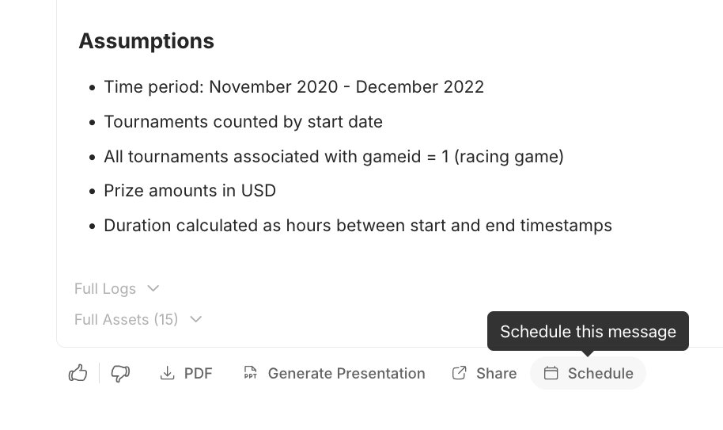
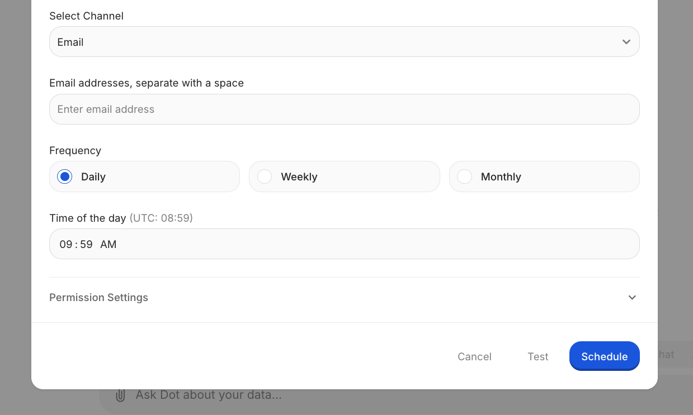

# Scheduling

Schedule Deep Analysis reports to be delivered automatically via Email, Slack, or Teams.

Unlike dashboard snapshots that show numbers, scheduled reports explain what changed and why—with trends, anomalies, and recommendations included.

### Use Cases

**Meeting prep**: Schedule 30 minutes before recurring meetings. Your team gets context without manually checking dashboards.

**Weekly reviews**: "What changed this week?" delivered Monday morning to Slack—ready for discussion.

**Replace dashboard check-ins**: Instead of pulling data, insights come to you.

### Creating a Schedule

You can schedule a Deep Analysis response or an [app](apps/README.md). On an app, open the menu and pick **Schedule delivery...**.

1. Run a Deep Analysis query
2. Click the **Schedule** button on the response

<figure><figcaption>
Click Schedule to set up recurring delivery
</figcaption></figure>

3. Under **To**, choose the channel (Email/Slack/Teams) and add recipients
4. Under **Each run**, choose what is sent (see below)
5. Under **Every**, set the frequency: day, weekday, week (pick the day) or month (pick the date), and the time
6. Click **Schedule**

<figure><figcaption>
Configure channel, recipients, and frequency
</figcaption></figure>

Click **Test** to send a preview before committing. **Attach PDF** adds a PDF to each delivery. For apps sent by email, **Native** shows the app's images and tables in the email itself. Large reports get a preview and a link.

### Each Run

| Option | What is sent | Cost |
|--------|--------------|------|
| Latest numbers | The same charts and tables, refreshed. No analysis. | 0.005 ACC |
| Brief | Latest numbers plus a short summary of what changed | 0.25 ACC |
| Fresh analysis | Dot re-investigates and writes up new findings | Metered |

Latest numbers and Brief need queries that can run again. If a message can't be re-run, only Fresh analysis is offered.

### Managing Schedules

Open the schedule modal on any scheduled message to:
- Edit frequency or recipients
- View run history (past deliveries and costs)
- Delete the schedule

### Only Send When...

Reduce noise by writing a plain-English condition under **Only send when...**. Leave it empty to send every run. Clear the text to remove a condition.

**Examples:**

- _"signups drop below 1,000"_
- _"revenue fell more than 5% week-over-week"_

Dot decides how to answer it:

- **A number on one of the app's charts** (on Latest numbers or Brief): click **Check**. Dot shows what it understood, the value right now, and how often it would have sent over the chart's history. Each run compares the numbers it already refreshed, so quiet runs cost nothing and show as `not_triggered` in run history. Once it sends, the same condition won't send again for at least a day by default.
- **Anything that needs judgement:** Dot runs a Fresh analysis every run and delivers only when your condition holds. Saving switches **Each run** to Fresh analysis, and every run is metered, sent or not. Suppressed reports show as `result_gate_suppressed` in run history.

On a chart in an app, the **Alert me** pill starts a condition for that chart.

### Pre-check on Messages

A scheduled message can have a pre-check that Dot writes for you in chat, based on a condition you describe. It runs first. If it fails, the run is skipped, no credits are used, and run history shows `work_gate_blocked`. The schedule dialog says "Only runs when its pre-check passes". Ask Dot in chat to change it.


If the pre-check hits an error, the run goes ahead anyway, so you never silently miss a report.


---

### Schedules as Code

Each app schedule is also a file in your model repo at `schedules/{id}.yaml`, so changes can be reviewed like other model changes. If a file edit changes who the run executes as or where it is sent, the schedule pauses until the owner or an admin confirms it in Dot.

### Scheduled Scripts

On workspaces where scheduled scripts are turned on, admins can have the Context Agent set up a Python script that runs on a schedule, at most hourly. It lives in `scheduled_scripts/{slug}/` in the model repo and must be confirmed before it runs. Scripts keep files between runs in a state folder, and can send Slack or email messages through Dot's API. They appear on the **Schedules** page.

---

### Costs & Limits

- **Latest numbers** costs 0.005 ACC (Agent Compute Credit) per run, **Brief** 0.25 ACC, and **Fresh analysis** is metered
- Pre-check blocks do **not** use credits, and neither do runs where a Latest numbers or Brief condition is not met
- A condition on a Fresh analysis **does** use credits (the agent ran, only delivery was held back)

### Admin Feature: Run As User

Admins can schedule reports to run as another user—useful for delivering reports with that user's data permissions.
