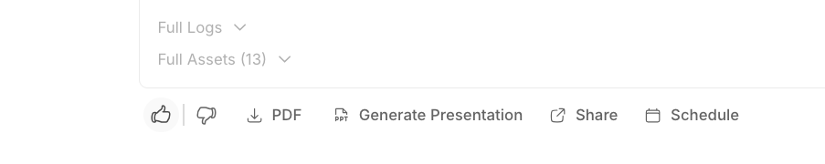
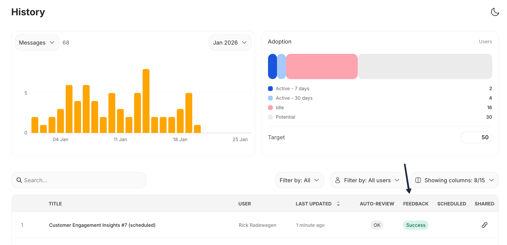

# User Feedback

Users can either upvote or downvote a response from Dot.

This feedback is used to expand Dots knowledge base, and give admins relevant insights to manage Dot.

## Positive Feedback

"Strengthen strengths" made young Boris Becker a world champion in Tennis 🎾.\
When a user clicks 👍, Dot will store the generated query for this question and reuse it for similar questions in the future.

<figure><figcaption>
Click thumbs up to save a successful query
</figcaption></figure>


Before a generated query gets used by Dot an admin needs to select it on the Model page.


## Negative feedback

👎 is a signal for admins that Dot's knowledge base needs to get adjusted to be better able to answer this question.

<figure><figcaption></figcaption></figure>

## Admin Overview

Admins can select to see the history of all users. All conversations with at least 1 dislike will show up with `problem` and if there is no dislikes and at least 1 like it shows as `success`.

<figure><figcaption>
View feedback across all users in History
</figcaption></figure>

