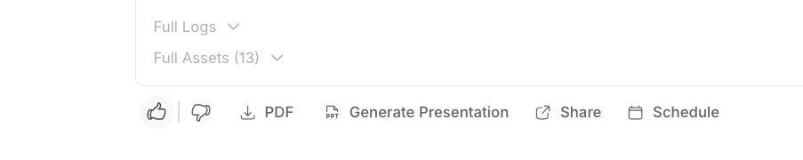
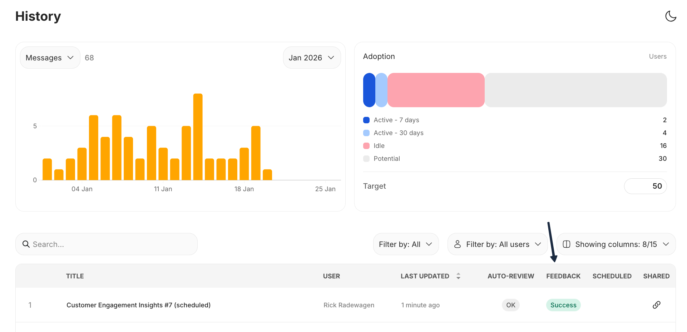

# User Feedback

Users can either upvote or downvote a response from Dot. This feedback tells admins where Dot's knowledge base needs work.

## Negative feedback

👎 is the signal worth acting on. Dot learns from being corrected far more than from being approved of: a downvote, ideally with a sentence about what the right answer was, tells an admin exactly which definition, table, or note is missing or wrong.

<figure><figcaption>
Users rate an answer with 👍 or 👎
</figcaption></figure>

## Positive Feedback

👍 marks an answer as good. It is a light-touch signal — useful for seeing which topics are working, but it does not by itself change how Dot answers in the future.

## Admin Overview

Admins can see the history of all users. Conversations show a **Feedback** column, based on what users clicked: at least one dislike shows as `Problem`, and likes with no dislikes show as `Success`.

Next to it, the **Auto-Review** column shows Dot's own assessment of each conversation — it reviews its answers in the background whether or not anyone clicks anything. See [Maintaining Dot](maintaining-dot.md) for how to work through both signals.

<figure><figcaption>
View feedback across all users in History
</figcaption></figure>
