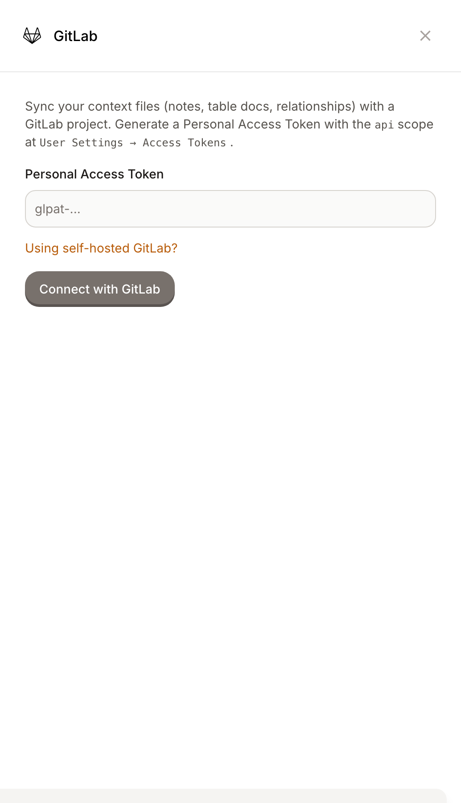
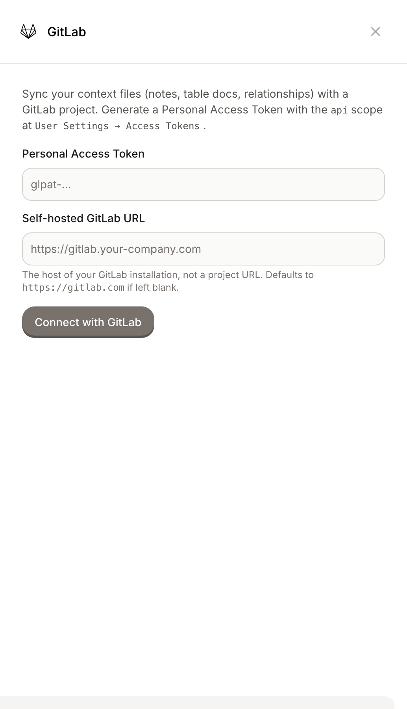
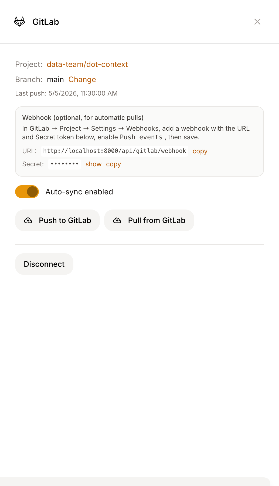

# GitLab

GitLab Sync enables bidirectional synchronization between Dot's context files and a GitLab project. It works with **gitlab.com** and **self-hosted GitLab** (Community or Enterprise Edition).

## Setting Up GitLab Sync

### Prerequisites

* Admin access to your Dot organization
* A GitLab account with the `api` scope on a Personal Access Token

### Step 1: Generate a Personal Access Token

In GitLab, go to **User Settings → Access Tokens** and create a new token with the `api` scope.


Make sure you're on **User Settings**, not **Project Settings**. Both pages look identical and use the same `glpat-` prefix, but a project access token authenticates as a bot user with no personal namespace — it can sync to existing projects but cannot create new ones.


### Step 2: Connect with GitLab

1. Go to **Settings** > **Version Control** > **GitLab**
2. Paste your token

<figure><figcaption>
Paste a Personal Access Token to connect
</figcaption></figure>

If you're on self-hosted GitLab, click **Using self-hosted GitLab?** and enter your instance URL (e.g. `https://gitlab.your-company.com`). Leave it blank for gitlab.com.

<figure><figcaption>
Enter your instance host for self-hosted GitLab
</figcaption></figure>


The GitLab URL field is the **instance** URL, not a project URL. If you paste a project URL like `https://gitlab.com/yourname/your-project`, Dot normalizes it to the host (`https://gitlab.com`) automatically.


3. Click **Connect with GitLab**. Dot validates the token against GitLab's API and stores it.

### Step 3: Configure Your Project

**Select existing project** (recommended): Pick a project from the list and choose a branch. This is the only option for project- or group-scoped tokens.

**Create new project**: Enter a name. Dot creates a private project under your namespace and pushes existing context files to it. This option requires a Personal Access Token (project bot tokens have no namespace they're allowed to write to).

### Step 4: Set Up the Webhook (optional, for automatic pulls)

Unlike GitHub, GitLab webhooks aren't created automatically. To pull changes into Dot when teammates push to GitLab directly, set up a webhook manually:

<figure><figcaption>
The configured panel surfaces the webhook URL and secret to paste into GitLab
</figcaption></figure>

1. In GitLab → your project → **Settings → Webhooks → Add new webhook**
2. Copy the **URL** from Dot's panel into GitLab's URL field
3. Copy the **Secret** from Dot's panel into GitLab's "Secret token" field
4. Enable **Push events** (filter to your sync branch if you like)
5. Save

When someone pushes to the configured branch, GitLab sends a signed event to Dot, and Dot pulls only the changed files.

### Step 5: Enable Auto-Sync

Toggle **Auto-sync enabled** to push changes to GitLab automatically when you edit context in Dot.

## How Sync Works

**Push (Dot → GitLab)**: Changes in Dot become commits in GitLab via the Repository Commits API — one atomic commit per change. The first push after configuration ships your existing context.

**Pull (GitLab → Dot)**: Changes pushed to GitLab trigger your configured webhook; Dot pulls the changed files and invalidates its caches so the AI sees the new content on the next call.

**Manual sync**: Use the **Push to GitLab** / **Pull from GitLab** buttons for one-off triggers.

## Token Types

GitLab has three kinds of tokens that all use the `glpat-` prefix:

| Token | Where to generate | Can connect | Can list/sync existing project | Can create new project |
| --- | --- | --- | --- | --- |
| Personal Access Token | User Settings → Access Tokens | ✓ | ✓ | ✓ |
| Group Access Token | Group Settings → Access Tokens | ✓ | ✓ (within group) | ✗ |
| Project Access Token | Project Settings → Access Tokens | ✓ | ✓ (that project only) | ✗ |

If Dot detects a project- or group-scoped token, the **Create new project** option is hidden and a notice explains why. Use a Personal Access Token if you want Dot to create the project for you.

## Limitations

* **One project per workspace**, syncing with a single branch
* **Markdown and YAML only** in the configured directories
* **Last write wins** for simultaneous direct edits (no conflict resolution UI)

**Not synced**: Database credentials, user accounts, chat history, scheduled reports, organization settings.

## Troubleshooting

| Issue | Solution |
| --- | --- |
| "GitLab rejected the token" | Make sure the token has the `api` scope and isn't expired |
| "Can't reach `<url>`" | Check the instance URL points at the host (e.g. `https://gitlab.com`), not a project page; verify the host is reachable from Dot's server |
| "responded 404 for /api/v4/user" | The URL isn't a GitLab instance — set the host, not a specific project URL |
| "This token can't create projects" | You're using a project- or group-scoped token. Use **Select existing project**, or generate a Personal Access Token at User Settings → Access Tokens |
| Branch is "protected" but I can push manually | Configure should still succeed — Dot no longer preemptively rejects protected branches. If a real push fails later because of branch protection, grant the token user push access in **Project → Settings → Repository → Protected branches** |
| Webhook isn't triggering pulls | Verify the URL and secret in GitLab match what Dot's panel shows; confirm **Push events** is enabled; check the configured branch matches |

## Self-hosted GitLab notes

* The instance URL is normalized to scheme + host. Trailing paths or project URLs are stripped automatically.
* Make sure the host is reachable from Dot's server (consider firewall rules and outbound network policy).
* Self-hosted instances often run a different default branch (e.g. `master`). Dot uses whatever branch GitLab created the project with — no need to override.

## Security

* The token is stored encrypted at rest alongside other org secrets.
* The webhook secret is generated per-org and rotated when you disconnect/reconnect.
* The webhook handler verifies `X-Gitlab-Token` constant-time and authenticates per-org — a webhook signed with org A's secret can't trigger pull jobs for org B sharing the same `project_id` (e.g. across self-hosted instances).
* Non-admin status callers can see the connection state but never the webhook secret.
