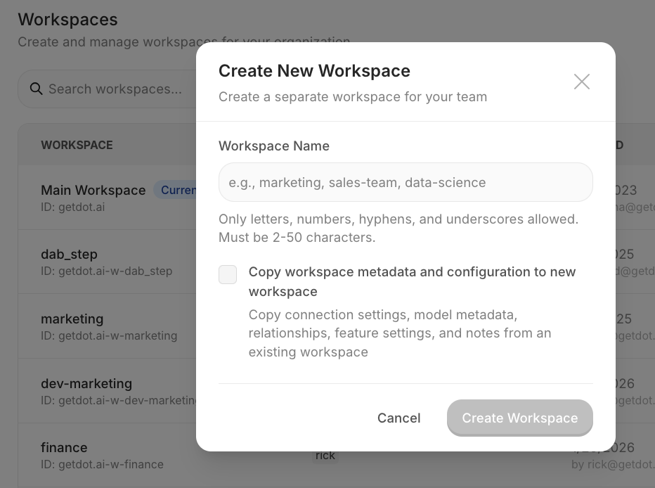
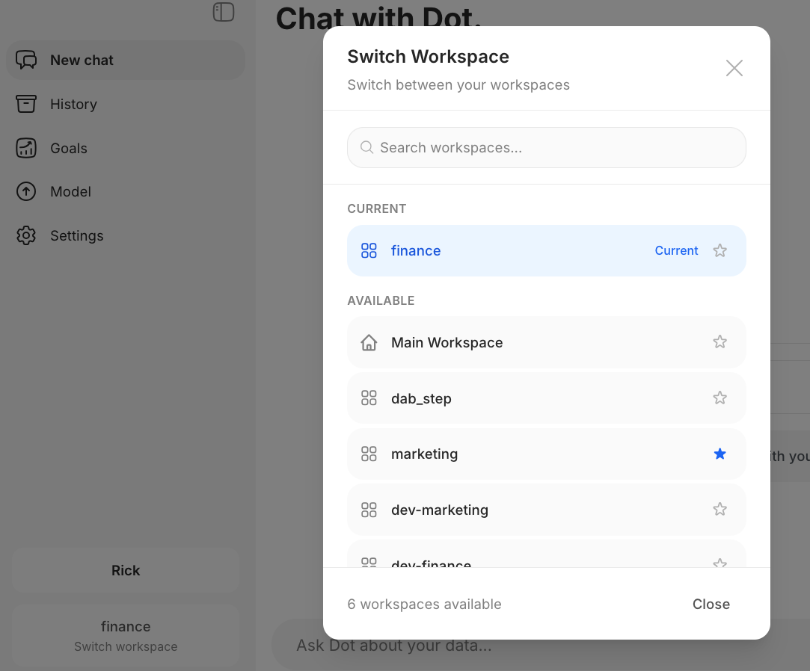

# Workspaces

Workspaces are isolated environments within your organization—separate users, data connections, and permissions, but shared billing.

**Use cases**: Team separation (Sales vs Finance), client isolation, regional data separation, testing environments.

### Creating a Workspace

*Org admins only*

1. **Settings → Workspaces → Create Workspace**
2. Enter a name, and optionally tick **Copy from an existing workspace** and pick the source
3. Done

A copy brings over Apps, connections, model context, skills, settings, and notes. Data, schedules, and shared links stay in the source. Copying a large workspace can take minutes, so the dialog shows a progress log while it works.

<figure><figcaption>
Create a new workspace with optional data copying
</figcaption></figure>

Limits: 10 workspaces (free) / 200 (unlimited).

### Sharing usage limits

By default each workspace sets its own weekly credit limits, so a person with a seat in three workspaces gets three allowances. In the main workspace, go to **Settings → Users → Usage Limits** and turn on **Share these limits with all workspaces** to give each person one allowance across all of them. Workspaces then show the main workspace's limits read-only, and usage counts across every workspace. The switch appears once the main workspace has at least one workspace. See [Agent Compute Credits](agent-compute-credits.md).

### Switching Workspaces

Click your **workspace name** (bottom-left) → select another workspace.

<figure><figcaption>
Switch between workspaces from the sidebar
</figcaption></figure>

You can set a default workspace in your user settings.

### Adding Users

1. **Settings → Workspaces** → find workspace → **Manage Users**
2. Enter email, select role (User/Admin), click Add

New users invited to a workspace can only see that workspace. Admins can grant full org access later.

### Slack & Teams Routing

Route specific channels to workspaces. See [Channel Routing](../integrations/slack-and-teams/channel-routing.md).
