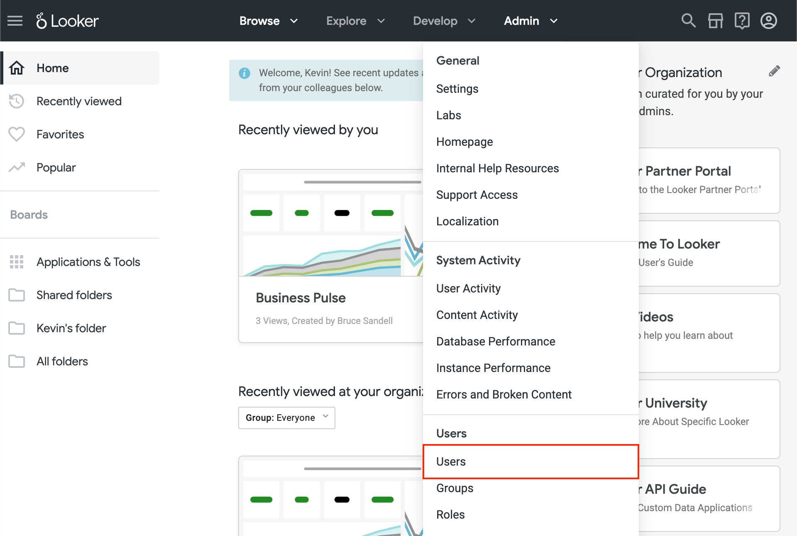

# Looker

## Create API keys

1. Go to your Looker dashboard: [https://company.cloud.looker.com](https://company.cloud.looker.com).
2. Click **Admin > Users** in the menu bar.

<figure><figcaption></figcaption></figure>

3. Click **Edit** next to a user.

<figure><figcaption></figcaption></figure>

4. Click the **Edit Keys** button next to API Keys.

<figure><figcaption></figcaption></figure>

4. Click **New API3 Key**.

<figure><figcaption></figcaption></figure>

5. Copy the **Client ID** and **Client Secret**.

<figure><figcaption></figcaption></figure>

##
