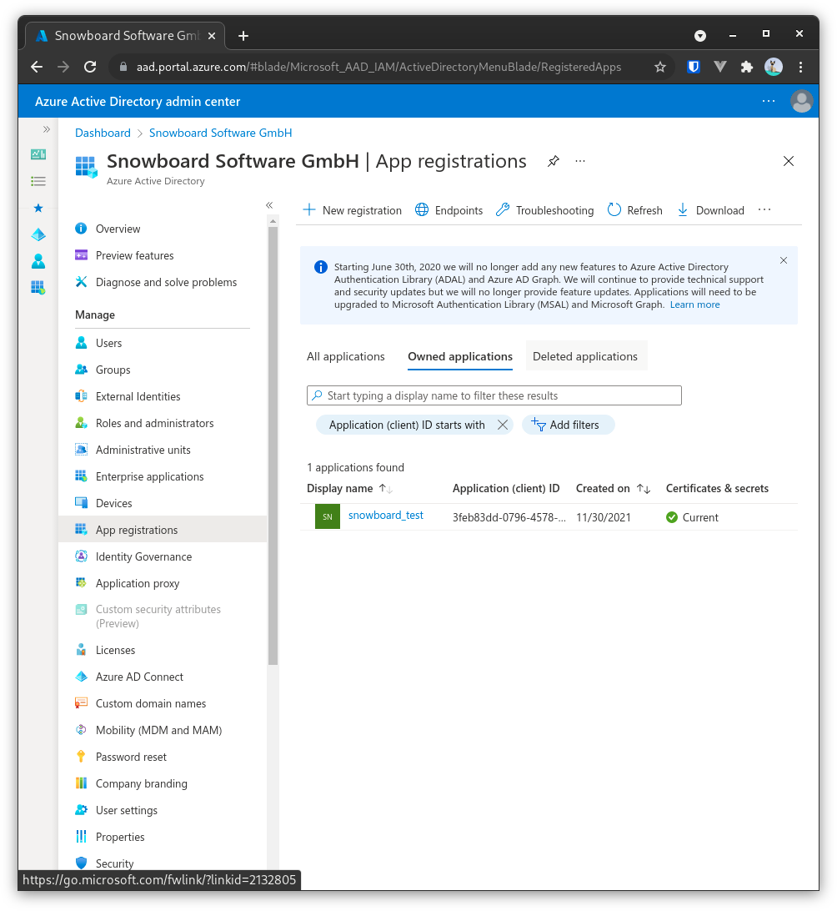

# PowerBI


## PowerBI App Registration, Permission

Go to Azure AD App registration, add “New registration”



Default selection is fine, add a name


Write down Application (Client ID)


Add a client secret, change the duration to an appropriate amount. Client secret has to be recreated each time it runs out and must also be changed in Snowboard afterwards


Write down Value, this is the Client secret for Snowboard


Go to API permissions


```
Add “Application Permissions” → “Tenant.Read.All” 
Add “Application Permissions” → “Report.Read.All” 
Add “Application Permissions” → “Report.ReadWrite.All”
```


Grant admin consent


Get AzureAD Tenant ID ([https://docs.microsoft.com/en-us/azure/active-directory/fundamentals/active-directory-how-to-find-tenant](https://docs.microsoft.com/en-us/azure/active-directory/fundamentals/active-directory-how-to-find-tenant))


**Shouldn’t be necessary, but for completeness sake:** Go to [https://login.microsoftonline.com/{tenant-id}/adminconsent?client\_id={client-id](https://login.microsoftonline.com/%7Btenant-id%7D/adminconsent?client\_id={client-id)} and grant permissions


Today Admin endpoints needed

`https://api.powerbi.com/v1.0/myorg/admin/groups`

[https://learn.microsoft.com/en-us/rest/api/power-bi/admin/reports-get-reports-in-group-as-admin](https://learn.microsoft.com/en-us/rest/api/power-bi/admin/reports-get-reports-in-group-as-admin)
