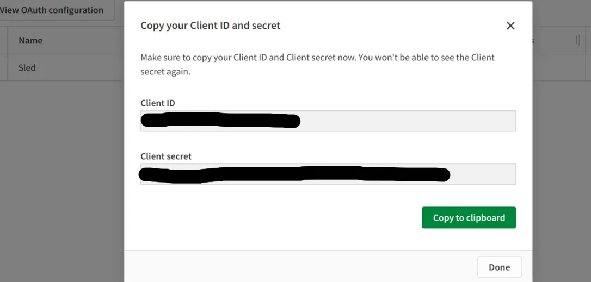

# Qlik

## Introduction

Sled, a comprehensive data cataloging tool for Snowflake, now supports integration with QlikSense Cloud. This integration enables users to visualize lineage between QlikSense assets and Snowflake objects, facilitating enhanced data governance and discovery.

## Features and Benefits

The QlikSense Cloud integration with Sled offers:

1. Lineage with Snowflake objects: Visualize relationships between QlikSense assets and Snowflake tables, views, and databases.
2. Metadata syncing: Automatically synchronize QlikSense assets, including Apps, Worksheets, and Spaces, to maintain up-to-date metadata.

## Connecting QlikSense Cloud to Sled

#### QlikSense Cloud Configuration

1. Open QlikSense Cloud in a web browser.
2. Navigate to the Qlik Admin section.
3. Click on OAuth.
4. Create a new OAuth web client named Sled.
5. Define the following scopes:
   * `admin.apps`
   * `apps`
   * `admin.data:export`
   * `spaces.shared`
   * `spaces.managed`
   * `spaces.data`
   * `users`
6. Check Allow Machine-to-Machine (M2M).
7. Click Save.
8.  Note the generated Client ID and Client Secret.

    <figure><figcaption></figcaption></figure>
9.  Click the three dots (...) on the far right and select Change consent method, then choose Trusted.

    <figure><figcaption></figcaption></figure>

#### Sled Configuration

1. Go to the Sled Settings page.
2. Navigate to Integrations and select Qlik Cloud as the new integration.
3.  Enter your Tenant URL as the server.

    <figure><figcaption></figcaption></figure>
4. Enter the Client ID and Client Secret noted from the QlikSense Cloud configuration.
5. Click Test Connection and if its successful then Click Save Account

## Verification

Once connected, verify the integration by:

1. Click the sync button to start the syncing job
2. Checking QlikSense asset metadata in Sled.
3. Visualizing lineage between QlikSense assets and Snowflake objects.

## Troubleshooting

For any issues or concerns, refer contact support.

By following these steps, you'll successfully integrate QlikSense Cloud with Sled, unlocking enhanced data governance and discovery capabilities.
